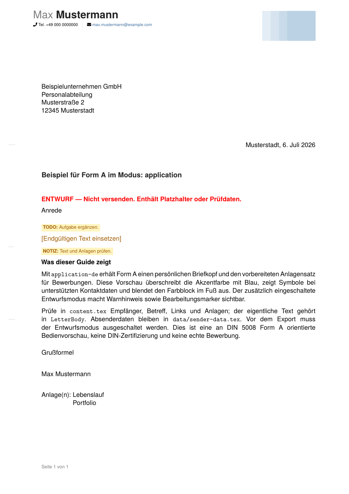
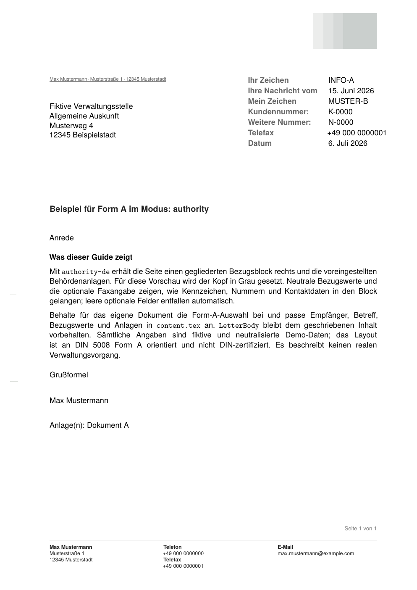
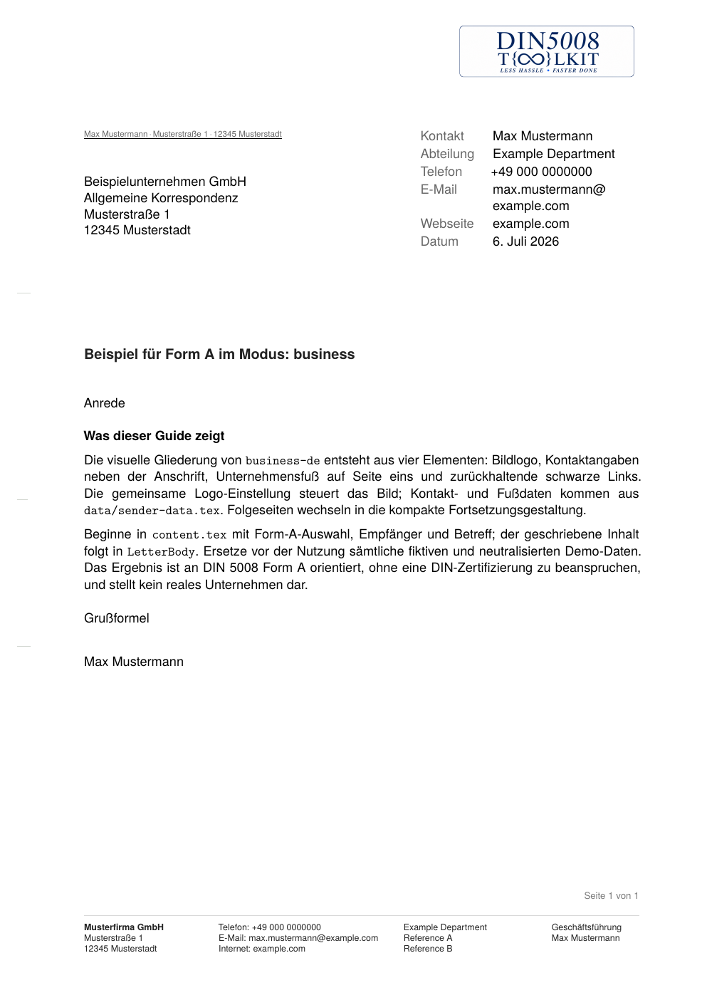
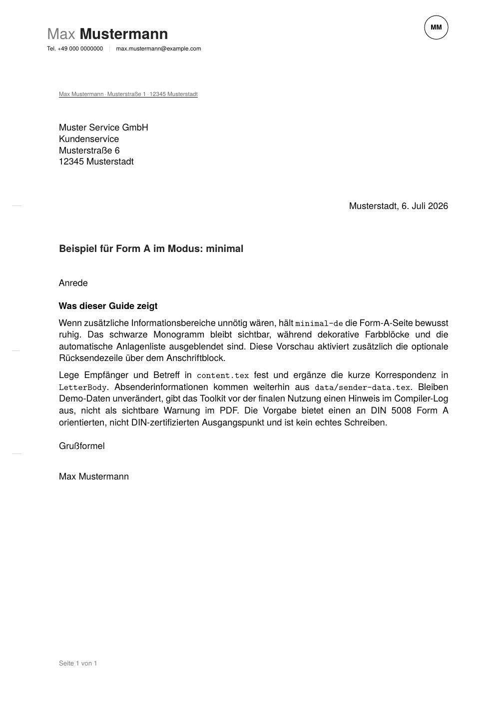
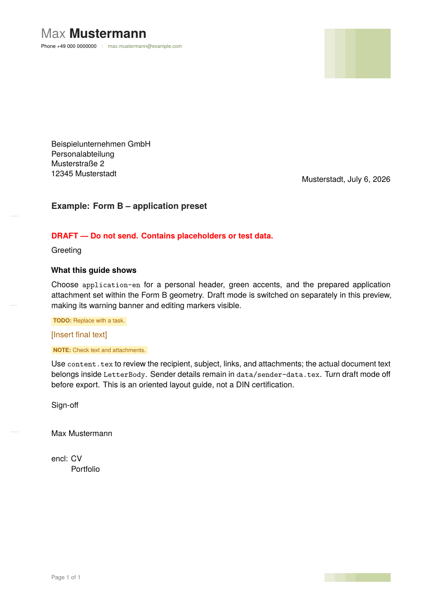
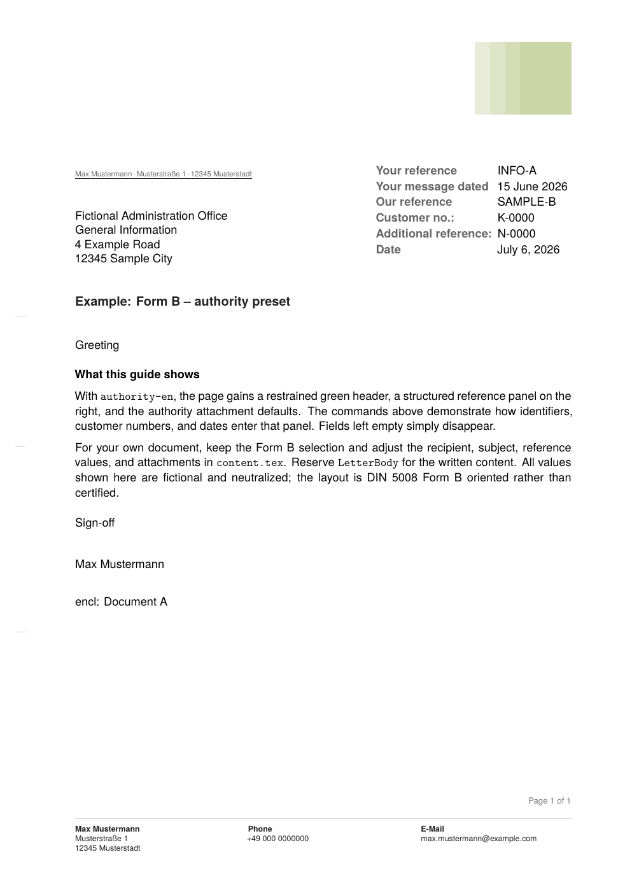
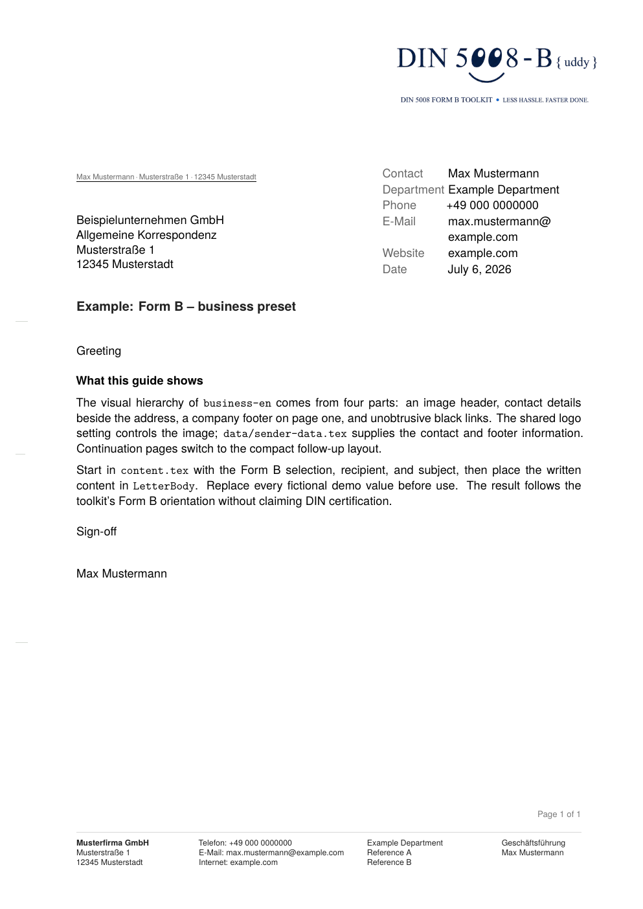
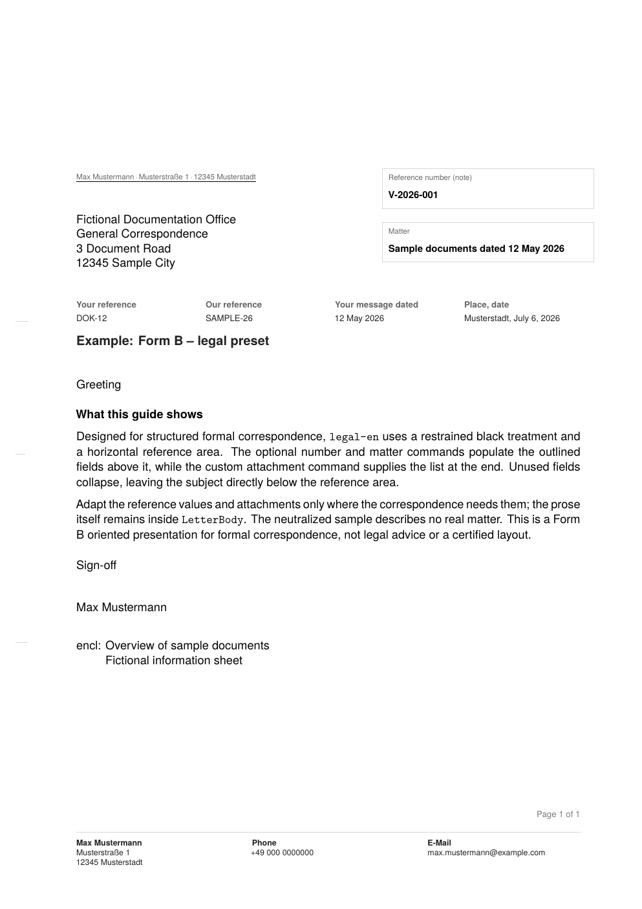
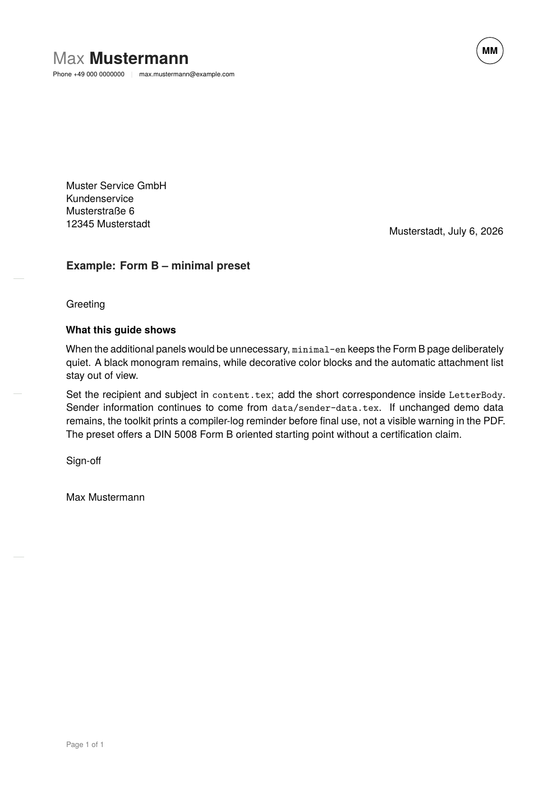

  

Language: English · [Deutsch](README.de.md)

# DIN5008 Toolkit

A focused XeLaTeX toolkit for letters oriented toward **DIN 5008 Form A or Form B**. Letter form, preset, and language remain separate choices, so one calm workflow covers applications, business correspondence, authority-oriented documents, formal correspondence, and reduced personal letters.

Ein übersichtliches XeLaTeX-Toolkit für Briefe, die sich an **DIN 5008 Form A oder Form B** orientieren. Briefform, Vorgabe und Sprache werden unabhängig gewählt – vom reduzierten persönlichen Schreiben bis zur formalen Geschäftskorrespondenz.

> The toolkit is not DIN-certified and does not claim official or universal compliance. 
> Das Toolkit ist nicht DIN-zertifiziert und erhebt keinen Anspruch auf offizielle oder allgemeingültige Konformität.

## Your path to a finished letter / Dein Weg zum fertigen Brief

The toolkit is designed around one short journey:

1. **See the result** in the preview gallery.
2. **Open the project** in Overleaf and select XeLaTeX.
3. **Choose Form A or B**, then choose one preset.
4. **Enter sender and recipient data** without touching the template internals.
5. **Write inside LetterBody**, compile <code>main.tex</code>, and review the PDF.

Auf Deutsch: Vorschau ansehen, Projekt in Overleaf öffnen, Briefform und Vorgabe wählen, Daten einsetzen, Brief schreiben und das fertige PDF kontrollieren. Für den normalen Einstieg genügen <code>content.tex</code> und <code>data/sender-data.tex</code>.

~~~tex
\UseLetterForm{A}       % A or B
\UsePreset{business-de} % one of ten presets
~~~

## Preview gallery / Vorschau

These are compact one-page guides, not real letters. They demonstrate the visual hierarchy and selected features of each preset using fictional and neutralized data.

### German · Form A

| Application | Authority | Business | Legal / Formal | Minimal |
|---|---|---|---|---|
|  |  |  |  |  |

### English · Form B

| Application | Authority | Business | Legal / Formal | Minimal |
|---|---|---|---|---|
|  |  |  |  |  |

## Five-minute Overleaf start / Schnellstart

A condensed in-editor version of these steps lives in [README-OVERLEAF.md](README-OVERLEAF.md), meant to travel inside the Overleaf project itself.

1. Upload or open the project in Overleaf.
2. Under **Menu → Compiler**, select **XeLaTeX**.
3. Set <code>main.tex</code> as the main document if Overleaf does not detect it automatically.
4. Open <code>content.tex</code> and keep exactly one form and one preset active.
5. Enter sender details in <code>data/sender-data.tex</code>.
6. Replace recipient, subject, references, and demonstration text.
7. Compile <code>main.tex</code> and inspect the resulting PDF.

After compiling, you should see a one-page letter that matches the Business preview above.

Kurz auf Deutsch: In Overleaf **XeLaTeX** und <code>main.tex</code> auswählen. Danach in <code>content.tex</code> genau eine Briefform und eine Vorgabe aktivieren, Absender- und Empfängerdaten ergänzen und den Demo-Inhalt vollständig ersetzen.

The editing model is deliberately simple:

~~~text
choose form → choose preset → enter sender → select recipient
→ set subject/references → write LetterBody → compile main.tex
~~~

## Choose form, preset, and language

### 1. Letter form / Briefform

~~~tex
\UseLetterForm{A}
% \UseLetterForm{B}
~~~

| Form | Character |
|---|---|
| Form A | Compact letterhead and higher address field |
| Form B | Larger letterhead area and lower address field |

Exactly one form should be active. Do not rely on an internal fallback.

### 2. Preset and language / Vorgabe und Sprache

| Purpose | German | English | Demonstrates |
|---|---|---|---|
| Application | <code>application-de</code> | <code>application-en</code> | Personal header, draft workflow, attachments |
| Business | <code>business-de</code> | <code>business-en</code> | Image header, information block, company footer |
| Authority | <code>authority-de</code> | <code>authority-en</code> | Structured reference block, restrained footer |
| Legal / Formal | <code>legal-de</code> | <code>legal-en</code> | Horizontal references, optional matter block |
| Minimal | <code>minimal-de</code> | <code>minimal-en</code> | Reduced styling and monogram |

The <code>-de</code> or <code>-en</code> suffix controls the visible language. Form and language are independent: Form A can be used in English, and Form B in German.

## Files you normally edit

~~~text
main.tex                    compile entry point; normally do not edit
content.tex                 form, preset, recipient, subject, and letter body
data/sender-data.tex        sender and contact details
data/addressbook.tex        optional reusable recipients
logo.png                    replaceable default header logo

letters/de-a/               German Form A guide sources
letters/en-b/               English Form B guide sources
letters/pdf/                generated public guide PDFs
letters/png/                generated public guide previews

template/form-a.tex         internal Form A geometry profile
template/form-b.tex         internal Form B geometry profile
template/                   shared internal template logic
~~~

For normal use, do not edit files in <code>template/</code>.

## Enter recipient and write the letter

The simplest recipient workflow is manual:

~~~tex
\UseRecipientManual
\SetManualRecipient{%
Placeholder Recipient\\
Placeholder Address\\
00000 Sample Place
}
~~~

Reusable recipients can instead be selected from <code>data/addressbook.tex</code>:

~~~tex
\UseRecipientAddressbook{generic-company}
~~~

To add your own reusable recipient, add one line to <code>data/addressbook.tex</code> and select it by key:

~~~tex
\DefineRecipient{my-office}{Example Office\\Sample Street 1\\00000 Sample Place}
% then in content.tex: \UseRecipientAddressbook{my-office}
~~~

An unknown key prints a visible notice in the PDF, so a typo is easy to spot. Keep only one recipient method active. Then write ordinary paragraphs inside <code>LetterBody</code>:

~~~tex
\begin{LetterBody}

Write your own letter here.

Additional paragraphs work normally.

\end{LetterBody}
~~~

<code>LetterBody</code> handles the resolved recipient, opening, mode-specific references, closing, and attachments. Replace all demonstration text before real use.

## Optional features when you need them

The curated preset is the starting point. Add overrides only when they serve the document.

| Feature | Command | Purpose |
|---|---|---|
| Icons | <code>\UseIconstrue</code> / <code>\UseIconsfalse</code> | Contact icons where supported |
| Draft review | <code>\DraftModetrue</code> | Shows the draft warning and enables review helpers |
| Review markers | <code>\TODO{...}</code>, <code>\PLACEHOLDER{...}</code>, <code>\DRAFTNOTE{...}</code> | Visible only in draft mode |
| Return address | <code>\UseBackaddresstrue</code> / <code>\UseBackaddressfalse</code> | Controls the optional return-address line |
| Automatic attachments | <code>\SetAttachmentsAuto</code> | Uses the selected preset's attachment list |
| No attachments | <code>\SetAttachmentsNone</code> | Suppresses the attachment list |
| Custom attachments | <code>\SetAttachmentsCustom{Document A\\Document B}</code> | Prints a supplied list |
| Custom logo | <code>\SetHeaderLogoFile{assets/my-logo.png}</code> | Selects a project-relative image |

Long names, links, addresses, references, and subjects can wrap differently. Always review the final PDF after enabling optional features.

### Custom HEX colors

Presets provide coordinated defaults. To customize individual color roles, add overrides in `content.tex` after `\UsePreset`. Use exactly six hexadecimal characters without a leading `#`:

~~~tex
\SetAccentColor{0072CE}
\SetColorBlockColors{EAF3FA}{D5E8F5}{BFDCEC}{9FC9E2}
\SetTextDarkColor{222222}
\SetTextMidColor{666666}
\SetTextLightColor{7B7B7B}
\SetLineColor{D7D7D7}
\SetFoldmarkColor{D3D7D1}
\SetNoticeBackgroundColor{EAF3FA}
\SetLinkColors{0072CE}{0072CE}
~~~

Each color-block segment can also be changed independently with `\SetColorBlockOneColor`, `\SetColorBlockTwoColor`, `\SetColorBlockThreeColor`, and `\SetColorBlockFourColor`. Invalid values stop the build with a concrete error.

## References and formal correspondence

Optional reference fields are configured in <code>content.tex</code>. Empty supported fields are omitted from the output.

- Authority supports structured reference information and an optional fax row.
- Legal / Formal supports horizontal references and optional reference / matter blocks.
- Additional identifiers can remain empty when they are not relevant.

The Legal / Formal preset is a layout for formal correspondence. It does not provide legal advice and is not a substitute for legal review.

## QA and validation

The toolkit has been checked through automated, visual, and physical tests:

- all ten public guides compile with two XeLaTeX passes;
- every guide PDF was checked as one-page A4 portrait output;
- logs were checked for LaTeX/package errors, missing assets, unresolved references, and visible <code>??</code>;
- Form A and Form B fold-mark configurations were verified independently;
- form-specific test branding was checked where used;
- all **2 forms × 5 modes × 2 languages (20 combinations)** passed an automated smoke test;
- representative two-page documents were used to verify continuation headers and resolved page totals;
- representative Form A and Form B outputs were reviewed in print-oriented checks.

The guide outputs were verified with an internal regression workflow before publication. Public guide PDFs and PNGs are updated only after manual review.

## Print and DIN 5008 scope

The toolkit is oriented toward DIN 5008 Form A and Form B geometry, including A4 page setup, address-window placement, text axes, reference areas, fold marks, headers, and footers.

It is not DIN-certified. Printer margins, scaling, installed fonts, content length, envelope setup, local requirements, and user overrides can affect the final result.

### DIN 5008-oriented layout features

The toolkit does not claim DIN certification. It implements a practical set of DIN 5008-oriented layout features for Form A and Form B correspondence.

| Area | Implemented in the toolkit |
|---|---|
| Page setup | A4 portrait layout |
| Letter forms | Separate Form A and Form B layout profiles |
| Header area | Form-specific header area for compact Form A and larger Form B layouts |
| Address field | Form-specific address field placement |
| Return address | Optional return-address line above the recipient address |
| Information / reference blocks | Mode-specific information and reference areas for business, authority-oriented, and formal correspondence |
| Text area | Consistent text axis and controlled body text area |
| Body text spacing | Normal `LetterBody` text uses approximately 130% line spacing |
| Fold marks | Form A and Form B fold mark positions |
| Hole mark | Center hole mark at the vertical middle of the page |
| Attachments | Mode-specific attachment handling |
| Continuation pages | Continuation headers and resolved page totals for multi-page letters |
| Print review | Representative print-oriented layout checks |

These features are intended as a practical starting point. Final responsibility for a specific letter remains with the user, especially when local organizational, legal, printer-specific, or envelope-specific requirements apply.

Review every PDF before sending it. Physically print-test important correspondence with the intended printer and envelope. Formal correspondence may also be subject to organizational or legal requirements outside this toolkit.

## Privacy and demonstration data

Included names, addresses, contact details, identifiers, and matters are fictional and neutralized demonstration data.

Before real use:

- replace sender, recipient, subject, body text, links, references, and attachments;
- inspect the generated PDF, not only the source;
- keep private references and personal test material out of public repositories;
- use fictional data in screenshots, examples, and public issue reports.

As a safety net, when draft mode is off and you compile <code>content.tex</code>, the build log reminds you if the shipped demo sender name, subject, or recipient are still in place. It is a log-only reminder and never appears in the letter. Disable it with <code>\CheckDemoDatafalse</code> if a demo value legitimately matches your own.

## Local build

Requirements:

- a LaTeX installation with XeLaTeX;
- <code>latexmk</code>;
- the selected fonts or one of the configured fallbacks.

From the project directory:

~~~sh
latexmk -xelatex -interaction=nonstopmode -halt-on-error main.tex
~~~

Overleaf is the recommended first-use path because it avoids many local installation differences.

## Troubleshooting

- A `fontspec`/font error usually means the compiler is set to pdfLaTeX; switch it to XeLaTeX.
- If the wrong document compiles in Overleaf, set <code>main.tex</code> as the main document.
- Unexpected layout or errors are often caused by more than one active form, preset, or recipient method; keep exactly one of each active.
- Different results on a local build are usually font-related; see the font fallback note under Local build.
- If a draft warning still appears in the PDF, draft mode is still on; disable it with <code>\DraftModefalse</code>.

## Known limitations

- No official DIN certification is claimed.
- The Legal / Formal preset does not provide legal advice.
- Accessible tagged PDF and PDF/A output are not claimed.
- Older TeX Live or KOMA-Script versions may require review or adjustments.
- Very long content and extensive optional fields require manual layout inspection.
- Advanced typography, color, header, and unusually long-content combinations are not exhaustively guaranteed by the preset regression.

## License

LaTeX source code, template logic, and toolkit structure are licensed under LPPL-1.3c. Documentation, examples, and preview material are licensed under CC BY 4.0 unless otherwise noted.

See [LICENSE](LICENSE), [LICENSE-CC-BY-4.0](LICENSE-CC-BY-4.0), and [NOTICE](NOTICE).
